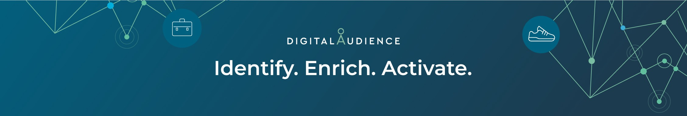

## Hey, this is us 👋

We empower brands, agencies publishers & technology partners to leverage offline deterministic data through identifying, enriching and activating this data into the digital ecosystem 🪐.

### 🍿 Our Story

digitalAudience developed a proprietary technology that activates valuable deterministic data for digital communication experiences. Brands, agencies publishers and technology partners can use this to identify consumers in the digital ecosystem for segmentation and targeting purposes in order to identify, enrich and activate customers and prospects 🚀.

digitalAudience was founded in 2015 to bring offline deterministic data solutions to the digital eco system. By this adding a scale of new use cases to the probabilistic data offering that was available in online advertising back then. Our goal from the start was to give brands the possibility to connect to their customers and prospect over digital domains in the way they were used to in offline marketing. We gained a footprint in the Dutch market by enhancing measurement, maximizing addressability over digital channels and increasing marketing ROI of our partners 🧙‍♂️.

Now we are the leading identity resolution platform in the Benelux and Nordics, offering our Customer Intelligence Platform to brands, agencies, publishers and tech partners that are on the forefront of digital marketing developments ✨.

Identity will play an increasingly important role in the digitization of marketing. digitalAudience will  be at the center of the digital eco system enabling transition to identity powered marketing! 🏄.
